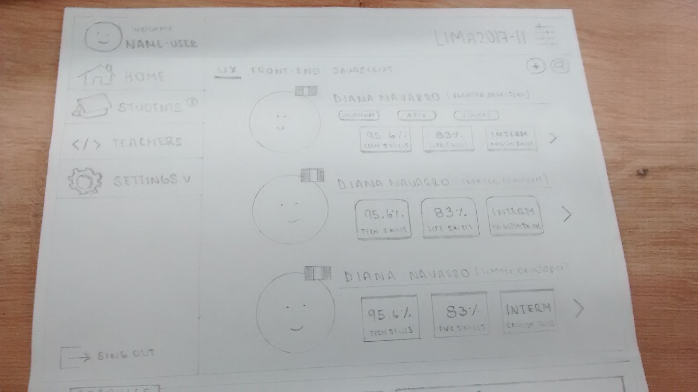
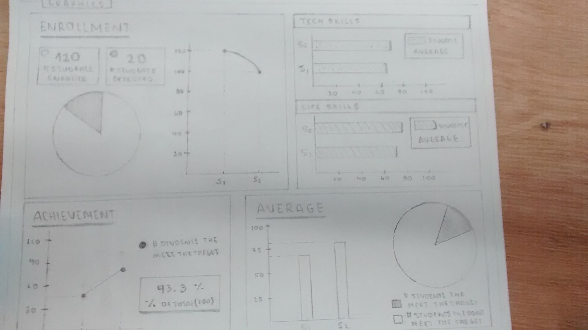

## **SKESH-DASHBOARD**

Las siguientes imagenes muestran diversas partes de un skesh para el Dashboard de Laboratoria.

1. Al dar click en el icono al lado de 'LIMA 2017 - II'

Se despliga un menu de opciones de las diversas sedes de Laboratoria: LIMA , AREQUIPA , CIUDAD DE MÉXICO Y SANTIAGO DE CHILE. 

2. Al dar click en la opción de 'LIMA' ; se despliga una menú de opciones con cada una de las promociones de esa sede en Laboratoria.

3. Al dar click en **' v '** al lado de Name-user

Se despliega un menu que muestra diversas secciones de la página : Home, students, teachers y una opción de configuración .

Al dar click en la opción ' SETTINGS V ' ; se despliga un menú que muestra 3 opciones: para añadir un sprint , añadir un aestudiante y retirar una estudiante.

VISTA GENERAL

4.  Al dar click en la opción de 'STUDENTS' se muestra la sección que presenta a cada una de la alumnas con sus respectivo *'skills'*.  
También se puede filtrar a las alumnas mediante la categoría : UX, FRONT-END Y JAVASCRIPT; el cual se encuentra la parte superior de la sección. 

5. Por último las siguientes imágenes muestra los diversos gráficos utilizados para poder ordenar la información.  
Se encuentran diversas secciones : *ENROLLMENT, TECH SKILLS, LIFE SKILLS, ACHIEVEMENT y AVERAGE.*

